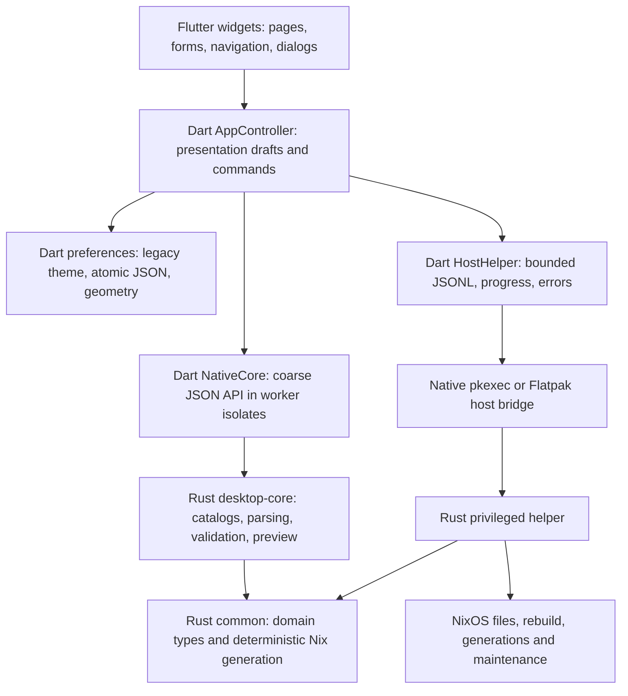

# Linux Flutter architecture

Flutter is the canonical desktop shell. Rust owns reusable configuration rules; privileged operations remain a separate host process. There is one frontend for native Linux and Flatpak.

## Responsibilities and state

`desktop/lib/ui` owns responsive layouts, Material 3 themes, focus, dialogs, shortcut intents and visual state. `AppController` owns a configuration DTO, form drafts, errors, dirty revisions, current page, progress and a bounded log. It uses `ChangeNotifier`; no additional state framework is needed for these eleven pages.

`ConfigurationDto` is a compatibility transfer object for the existing Rust `AppState`, not a second business model. Dart updates selections; Rust validates them and renders the output. Invalid text drafts remain separate from valid domain values, survive navigation and prevent apply. Bundle metadata and package mappings come from Rust. Apply takes a deep snapshot and clears dirty state only after rebuild and state persistence both succeed, provided no subsequent selection revision exists.

`crates/common` owns catalogs, DTOs, parsing/classification, host read-only probes, input validation and Nix generation. The parser and host probes were extracted from the former GUI; its modules now re-export the shared implementation. Preview and helper use the same profile fallback. Flutter does not depend on libcosmic.

`crates/desktop-core` exposes `bootstrap`, `probe_host`, `parse_packages`, `validate`, `preview` and `profile_preview`. Domain requests are Serde types. JSON responses carry `ok/result` or `error {kind,message}` and bootstrap supplies API version 1. Rust does not know about widgets, `BuildContext`, theme, focus or routes.

## Bridge choice and ownership

A maintained generator such as flutter_rust_bridge would provide generated DTOs, streams and handles. This application's core boundary has six bounded value operations, no object handles and no native callbacks. Direct Dart FFI therefore gives a smaller build surface with two exported functions and no generator lifecycle to maintain. The comparison considered Linux support, Flatpak library loading, async dispatch, typed errors, ownership and build reproducibility; other OS targets are outside the requested scope.

Dart allocates UTF-8 request bytes and borrows them to `toolkit_call(pointer,length)`. Rust returns a NUL-terminated owned JSON string. Dart decodes it and calls `toolkit_free` exactly once in `finally`; it independently frees its own input. A 1 MiB request bound applies on both sides. Null pointers, protocol errors and caught Rust panics become explicit failures. Rust FFI safety requirements are documented beside both exported functions. The domain implementation itself uses safe Rust.

`Isolate.run` keeps parsing, host probes and generation off the UI isolate. Catalogs arrive in one bootstrap response; rendering checkboxes causes no FFI calls. Generation occurs on preview request or page entry. Concurrent calls share no mutable core state. Core tasks have no cancellation API; long-running rebuilds are separate process operations. Tests exercise the actual shared library, concurrent calls, Unicode paths/data, size limits, typed errors and repeated allocation/free. No generated bridge files need regeneration.

## Host operations and Flatpak

The UI never becomes root. `HostHelper` launches fixed argv through `pkexec`, or `flatpak-spawn --host` with stdin/stdout forwarded. An explicit helper override must be absolute and executable; failed overrides do not silently select another helper. Capability probing requires an actual NixOS host and a helper before enabling host operations.

The existing JSONL request/response format stays compatible. An apply session sends EnsureDirectories, Apply and WriteState in order; DryBuild sends only Apply. Responses are bounded while receiving, progress is streamed, unexpected response types fail, and rebuild or persistence failure retains dirty state. Cancellation terminates the launched protocol process and reports interruption. Termination of an authenticated root helper and its rebuild descendants has **not** been verified; cancellation must not be interpreted as rollback or proof that the host stopped changing.

Host file writes, validation, dry-run snapshots/restoration, rebuild selection, generation activation/deletion and allowlisted maintenance remain Rust helper responsibilities. Network requests for Nix input updates happen through host commands. The application has no networking engine to rewrite.

## Preferences and packaging

Dart owns lightweight preferences at `$XDG_CONFIG_HOME/nixos-toolkit/preferences.json` (fallback `~/.config`). It reads the legacy `color_scheme` key and, when JSON is absent, the cosmic `v1/color_scheme` file. It persists theme and window geometry with serialized temporary-file/rename writes. Corrupt JSON is diagnosed and preserved before replacement. Host state remains `/etc/nixos/nixos-toolkit/state/state.json` and is not written by this preference service.

The Linux CMake build invokes Cargo and bundles `libnixos_toolkit_core.so`, Flutter, plugin libraries, AOT code and templates. Paths derive from the running executable, so launching outside the checkout works. Nix builds the same core separately, passes its immutable store path to CMake, and bundles it through the same installation rules. Flatpak installs the complete checksummed release bundle under `/app/lib/nixos-toolkit`; its launcher preserves these relative paths.

The former GUI is exposed only as a reference package while real NixOS host parity is pending. Removing it before that gate would discard the functional comparison required by the audit.
