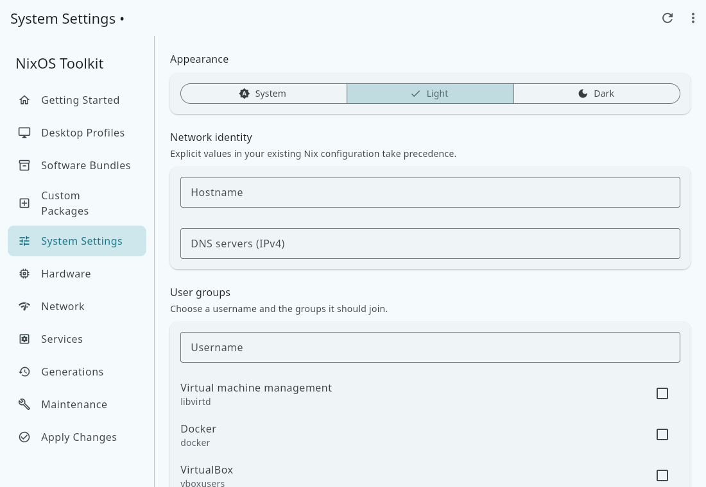
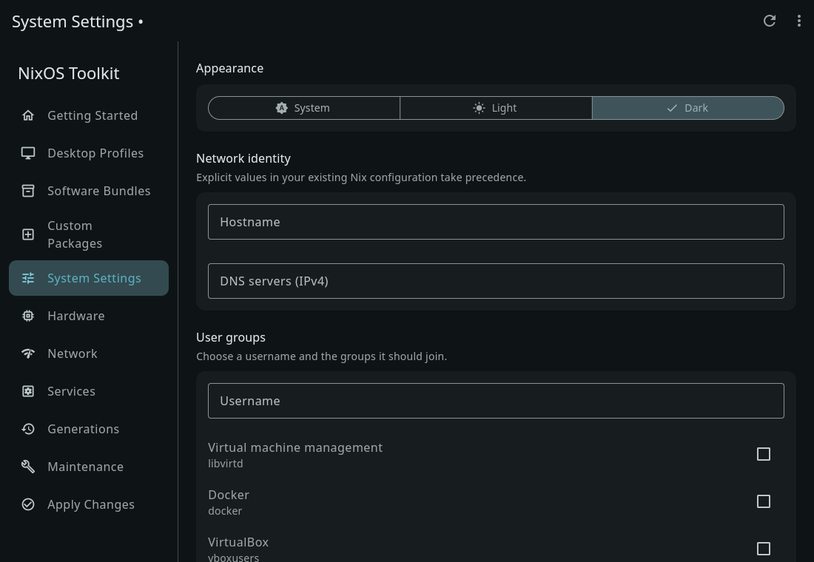

# NixOS Toolkit

NixOS Toolkit is a Linux desktop application for declarative NixOS management. The canonical frontend uses **Flutter/Dart**, with a shared **Rust core** and a separate privileged host helper. Linux and Linux Flatpak are the supported scope.

Choose from 13 desktop profiles, 16 software bundles, custom packages, hardware, network and 21 service settings. Review generated Nix locally, then apply through the host helper. Generations, maintenance and store usage also use that helper. On other Linux distributions, configuration and preview remain available; privileged actions explain their NixOS requirement.




## Develop

With stable Flutter, Rust and the Linux dependencies in [BUILDING.md](BUILDING.md):

```sh
cargo build --locked -p desktop-core
cd desktop
flutter pub get --enforce-lockfile
flutter run -d linux
```

The Flutter Linux build automatically builds and bundles the Rust library and Nix templates. Run the normal verification gate with `scripts/verify.sh`. Create a release archive with `scripts/package-linux.sh`.

In this cloud workspace, first run `. /workspace/setup/activate.sh`; the tools are installed without requiring system administrator access.

## Host integration

The UI stays unprivileged. Install `nixos-toolkit-helper` and its polkit policy through the NixOS module, then add the managed `selected.nix` import using the application's instructions. Existing Nix configuration remains under your control. Managed state retains its existing JSON format and path. Preferences retain the canonical XDG file and read the former cosmic theme setting when needed.

```nix
programs.nixos-toolkit.enable = true;
```

`nix build .#gui` and `nix run` now select Flutter. `.#helper` remains the host helper; `.#reference` retains the former GUI for parity checks. The Flutter Nix package, core and helper build successfully. System activation requires validation on a NixOS host.

## Validation and release status

Native Linux debug/release builds, 245 Rust tests, 22 Flutter tests, analyzer, formatting, bridge calls, live page navigation, Light/Dark appearance and minimum-size layout passed in the cloud environment. Checksummed native and Flatpak release bundles are generated in `dist/`.

The Flatpak was built, exported, installed and tested inside its sandbox with the real Rust API. Its eleven pages, package entry, local preview, resizing and saved dark theme were checked live. Native and Flatpak also passed 2× display rendering, nested Wayland rendering and clipboard transfer. The Nix package also passes packaged API diagnostics with a Nix Mesa driver. Real NixOS rebuild, rollback, maintenance, authenticated cancellation, desktop portals/accessibility and OS theme notifications remain release gates; this Debian container cannot establish those results. Remote CI has not been run from this workspace. [PLATFORM_SUPPORT.md](PLATFORM_SUPPORT.md) records the exact limits.

[ARCHITECTURE.md](ARCHITECTURE.md) explains state and bridge ownership. [MIGRATION_AUDIT.md](MIGRATION_AUDIT.md) accounts for the reference features, changes and remaining QA. Older implementation documents under `docs/audit` and `docs/migration` are historical; the old frontend remains a reference until host parity checks pass.

GPL-3.0-or-later. [Report an issue](https://github.com/goshitsarch-eng/Gosh-NixOS-Manager/issues).
